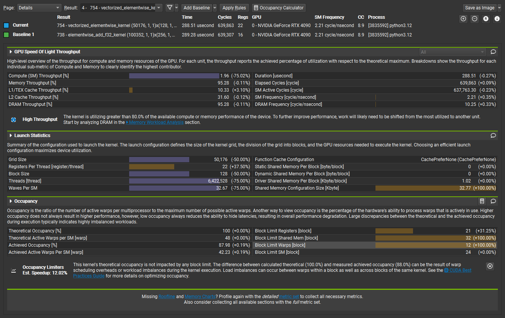

# Element Wise Kernel
参考代码来自：[https://github.com/DefTruth/CUDA-Learn-Notes/tree/main/elementwise](https://github.com/DefTruth/CUDA-Learn-Notes/tree/main/elementwise)

## Linux Environments
* 显卡 GeForce RTX 4090
* Ubuntu 20.04.2
* NVIDIA Driver: 535.183.01
* CUDA: 12.2
* CMake: 3.16.3
* GCC: 9.4.0

## anaconda Environments
* Python: 3.12
* PyTorch: 2.4.1 py3.12_cuda12.1_cudnn9.1.0_0
* pytorch-cuda 12.1
* Ninja: 1.12.1


## PyTorch
### Compile cpp and cuda

**Setuptools**
使用下面的代码编译setup
```shell
python3 pytorch/setup.py install
```

### Run python
**Compare kernel running time**

|&nbsp;&nbsp;cuda  time: 337.410us &nbsp;&nbsp;|&nbsp;&nbsp;torch time: 346.851us  &nbsp;&nbsp;|
```shell
python3 pytorch/time.py
```

资源和性能分析使用如下代码，具体profile如图所示
```shell
sudo /usr/local/cuda-12.2/bin/ncu -f --replay-mode application -o profile /home/ic611/anaconda3/envs/cuda12_1/bin/python ./pytorch/time.py
```


### Clean
```shell
make clean
```

### Setup卸载element_wise库
```shell
pip uninstall element_wise
```
